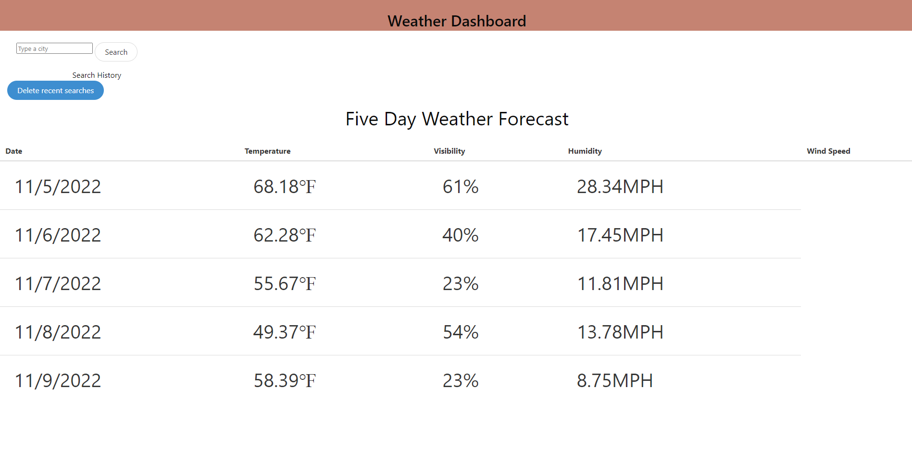

# Weather Dashboard
This is a weather dashboard app that allows a user to see the weather outlook for multiple cities. 
It features the OpenWeather One Call API, jQuery, Bootstrap, dynamically updated HTML and CSS, and persistent data stored in localStorage.

## Table of Contents
- [Link](#link)
- [Screenshots](#screenshots)
- [License](#license)
- [Contact](#contact)

## Link
https://jroller33.github.io/Weather-Dashboard/

## Screenshots

## License
This project is licensed under the [MIT License](https://www.mit.edu/~amini/LICENSE.md).

## Contact
[GitHub](https://github.com/jroller33)

